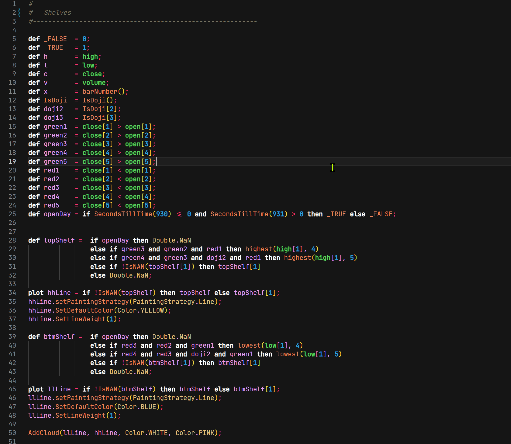
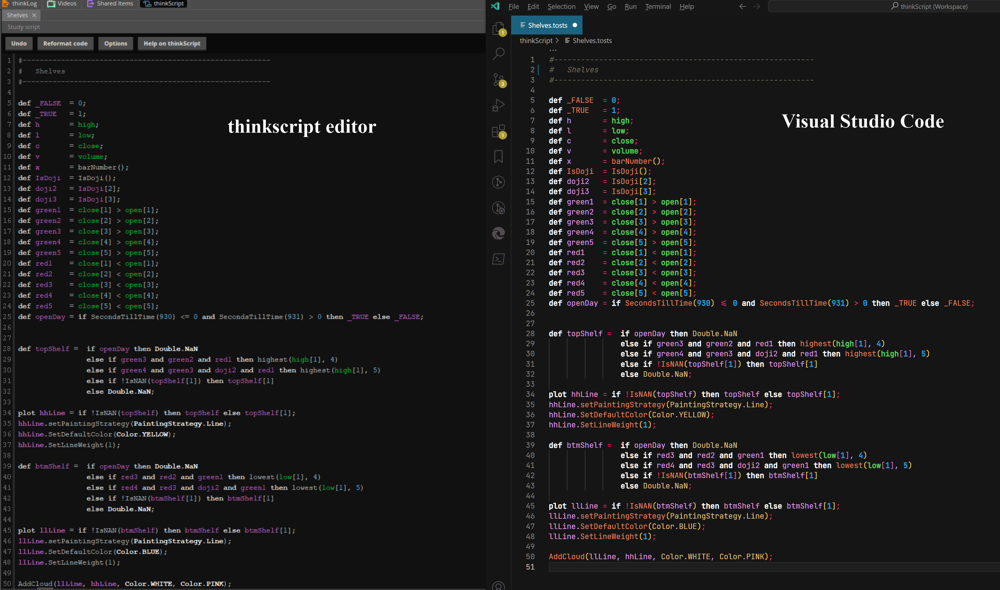

  

<h1  align="center"> thinkscript color theme </h1> 

A color theme dedicated for the thinkscript language, this resembles the thinkorswim editor colors but with more distinction of reserved words, functions, numbers, etc.

---
### Sample Screenshot

### A side-by-side Screenshot

---

### Contributions

- If you want to report an error or want to suggest anything just send us an [e-mail](mailto:tools@ridertradingtools.com)

---

### Version 
- *1.0.1*

- ---
#### Disclaimer
Not affiliated in any way, shape or form (other than a client) of Charles Schwab or TD Ameritrade.

